# Authentication APIs

Tất cả endpoint trong tài liệu này bắt đầu với base path:

`/api/users`

---

## 1. POST /register

- Method: `POST`
- Description: Đăng ký tài khoản mới.
- Authentication: Không yêu cầu.

### Request Body

```json
{
    "name": "string",
    "email": "string",
    "password": "string",
    "confirm_password": "string",
    "date_of_birth": "YYYY-MM-DD"
}
```

### Validation Rules

- `name`: required, string, 1-100 ký tự.
- `email`: required, valid email, không trùng email đã tồn tại.
- `password`: required, 6-50 ký tự, phải chứa ít nhất 1 chữ hoa, 1 chữ thường, 1 số và 1 ký tự đặc biệt.
- `confirm_password`: required, phải khớp `password`.
- `date_of_birth`: nếu có, phải là định dạng ISO 8601 hợp lệ.

### Success Response

- Status: `201 Created`
- Body:

```json
{
    "message": "Đăng ký thành công",
    "result": {
        "access_token": "string",
        "refresh_token": "string"
    }
}
```

### Error Responses

- `422 Unprocessable Entity`: dữ liệu input không hợp lệ.
- `409 Conflict`: `email` đã tồn tại.
- `500 Internal Server Error`: lỗi hệ thống.

### Business Logic

- Tạo user mới với `username` tự sinh `user_<ObjectId>`.
- Hash mật khẩu trước khi lưu.
- Sinh `email_verify_token`, lưu vào user.
- Tạo access token và refresh token.
- Lưu refresh token vào collection `refresh_tokens`.
- Hiện tại email verify token được ghi vào console, chưa gửi email thực tế.

### Sequence Diagram

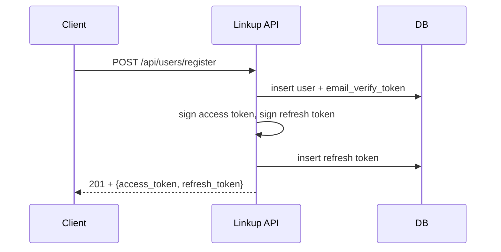

---

## 2. POST /login

- Method: `POST`
- Description: Đăng nhập bằng email và mật khẩu.
- Authentication: Không yêu cầu.

### Request Body

```json
{
    "email": "string",
    "password": "string"
}
```

### Validation Rules

- `email`: required, valid email.
- `password`: required, 6-50 ký tự.
- Kiểm tra email và password khớp dữ liệu trong DB.

### Success Response

- Status: `200 OK`
- Body:

```json
{
    "message": "Đăng nhập thành công",
    "result": {
        "access_token": "string",
        "refresh_token": "string"
    }
}
```

### Error Responses

- `401 Unauthorized`: email hoặc mật khẩu không chính xác.
- `422 Unprocessable Entity`: dữ liệu input không hợp lệ.

### Business Logic

- Kiểm tra user tồn tại với email và hash password.
- Nếu hợp lệ, tạo access token và refresh token mới.
- Lưu refresh token vào DB.

### Sequence Diagram

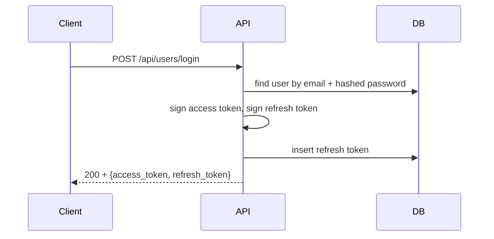

---

## 3. POST /logout

- Method: `POST`
- Description: Đăng xuất và vô hiệu hóa refresh token.
- Authentication: Yêu cầu Bearer access token.

### Headers

- `Authorization: Bearer <access_token>`

### Request Body

```json
{
    "refresh_token": "string"
}
```

### Validation Rules

- `Authorization`: required, phải là JWT access token hợp lệ.
- `refresh_token`: required.

### Success Response

- Status: `200 OK`
- Body:

```json
{
    "message": "Đăng xuất thành công"
}
```

### Error Responses

- `401 Unauthorized`: access token hoặc refresh token không hợp lệ.
- `422 Unprocessable Entity`: yêu cầu body không hợp lệ.

### Business Logic

- Xác thực access token.
- Xóa document refresh token tương ứng khỏi collection `refresh_tokens`.

### Sequence Diagram

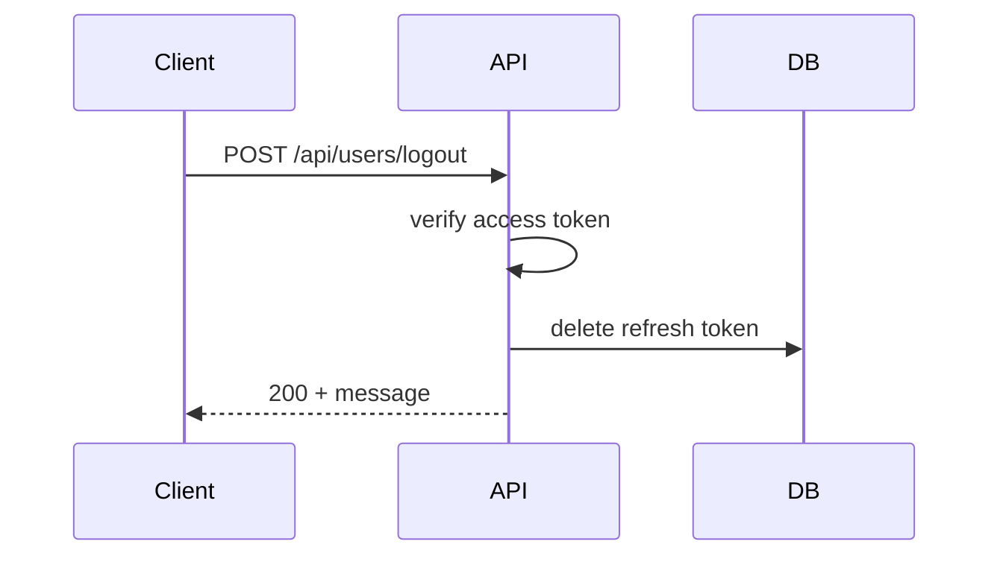

---

## 4. POST /refresh-token

- Method: `POST`
- Description: Lấy access token mới bằng refresh token.
- Authentication: Không yêu cầu access token.

### Request Body

```json
{
    "refresh_token": "string"
}
```

### Validation Rules

- `refresh_token`: required, phải là JWT refresh token hợp lệ.
- Token phải tồn tại trong DB `refresh_tokens`.
- Phải có `token_type: RefreshToken`.

### Success Response

- Status: `200 OK`
- Body:

```json
{
    "message": "Làm mới token thành công",
    "result": {
        "access_token": "string",
        "refresh_token": "string"
    }
}
```

### Error Responses

- `401 Unauthorized`: refresh token không hợp lệ hoặc không tồn tại.
- `422 Unprocessable Entity`: body không hợp lệ.

### Business Logic

- Verify refresh token và kiểm tra token type.
- Xóa refresh token cũ khỏi DB.
- Sinh access token và refresh token mới.
- Lưu refresh token mới.

### Sequence Diagram

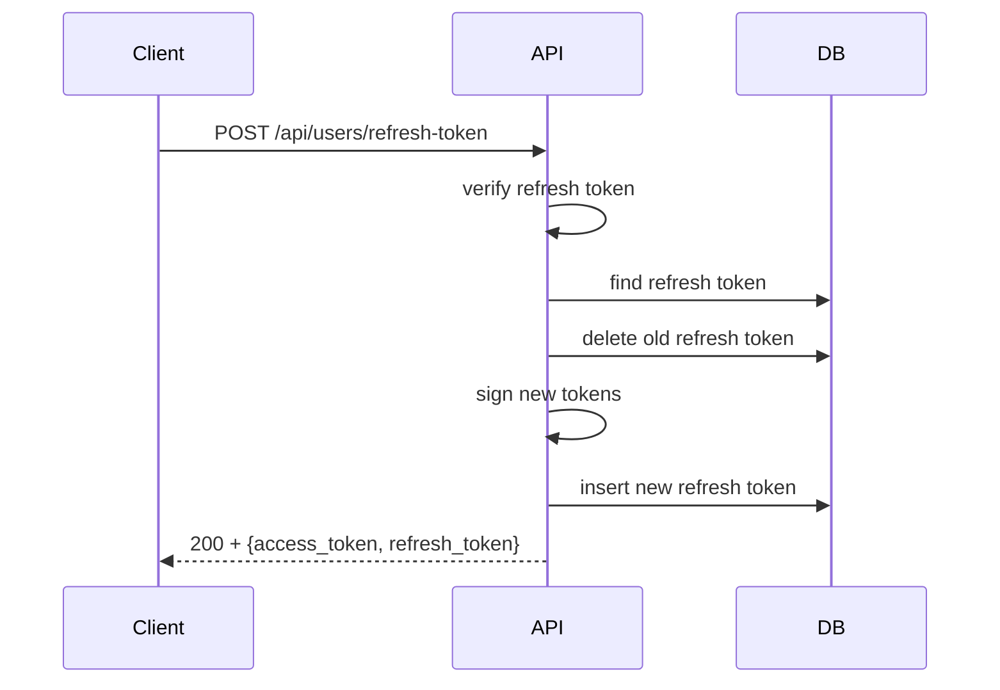

---

## 5. POST /verify-email

- Method: `POST`
- Description: Xác thực email bằng token do hệ thống gửi.
- Authentication: Không yêu cầu access token.

### Request Body

```json
{
    "email_verify_token": "string"
}
```

### Validation Rules

- `email_verify_token`: required, JWT hợp lệ.
- Token phải có `token_type: EmailVerifyToken`.
- User phải tồn tại và chưa verify.
- Token phải trùng với `email_verify_token` lưu trong DB.

### Success Response

- Status: `200 OK`
- Body:

```json
{
    "message": "Xác thực email thành công",
    "result": {
        "access_token": "string",
        "refresh_token": "string"
    }
}
```

### Error Responses

- `401 Unauthorized`: token không hợp lệ.
- `404 Not Found`: user không tồn tại.
- `200 OK`: email đã verify rồi (được xử lý là trường hợp đặc biệt, message `Email đã được xác thực`).

### Business Logic

- Verify token.
- Cập nhật user: `verify = Verified`, xóa `email_verify_token`.
- Xóa tất cả refresh token cũ của user.
- Sinh access token và refresh token mới.

### Sequence Diagram

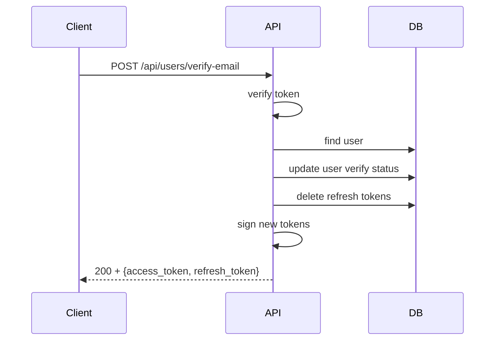

---

## 6. POST /resend-verify-email

- Method: `POST`
- Description: Gửi lại link xác thực email cho user chưa verify.
- Authentication: Yêu cầu Bearer access token.

### Headers

- `Authorization: Bearer <access_token>`

### Request Body

- Không có body bắt buộc.

### Validation Rules

- `Authorization`: required, access token hợp lệ.
- User tồn tại.
- User chưa verify.

### Success Response

- Status: `200 OK`
- Body:

```json
{
    "message": "Gửi lại email xác thực thành công"
}
```

### Error Responses

- `401 Unauthorized`: access token không hợp lệ.
- `404 Not Found`: user không tồn tại.
- `200 OK`: email đã được xác thực (không gửi lại token).

### Business Logic

- Verify access token.
- Nếu user chưa verified, sinh email verify token mới.
- Cập nhật `email_verify_token` trong DB.
- Hiện tại token mới được ghi vào console.

### Sequence Diagram

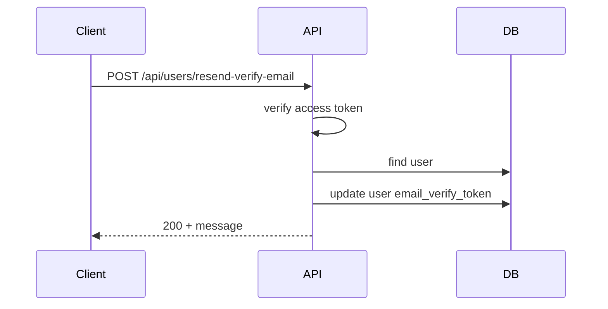

---

## 7. POST /forgot-password

- Method: `POST`
- Description: Yêu cầu gửi email reset mật khẩu.
- Authentication: Không yêu cầu access token.

### Request Body

```json
{
    "email": "string"
}
```

### Validation Rules

- `email`: required, valid email.
- User tồn tại.

### Success Response

- Status: `200 OK`
- Body:

```json
{
    "message": "Gửi email reset mật khẩu thành công"
}
```

### Error Responses

- `404 Not Found`: user không tồn tại.
- `422 Unprocessable Entity`: dữ liệu không hợp lệ.

### Business Logic

- Tìm user theo email.
- Sinh `forgot_password_token` và lưu vào user.
- Hiện tại token ghi vào console.

### Sequence Diagram

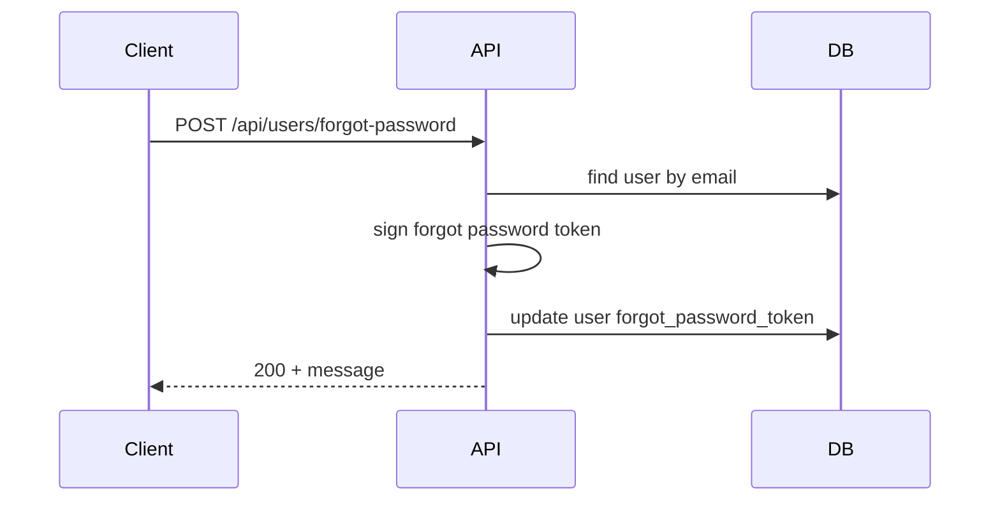

---

## 8. POST /verify-forgot-password

- Method: `POST`
- Description: Xác thực token reset mật khẩu.
- Authentication: Không yêu cầu access token.

### Request Body

```json
{
    "forgot_password_token": "string"
}
```

### Validation Rules

- `forgot_password_token`: required, JWT hợp lệ.
- Token phải có `token_type: ForgotPasswordToken`.
- User tồn tại.
- Token phải trùng với giá trị `forgot_password_token` lưu trong DB.

### Success Response

- Status: `200 OK`
- Body:

```json
{
    "message": "Xác thực forgot password token thành công"
}
```

### Error Responses

- `401 Unauthorized`: token không hợp lệ.
- `404 Not Found`: user không tồn tại.

### Business Logic

- Verify token và kiểm tra token type.
- Xác nhận token đúng với user.

### Sequence Diagram

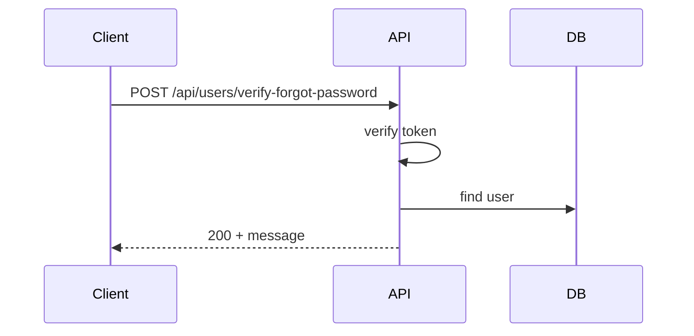

---

## 9. POST /reset-password

- Method: `POST`
- Description: Đặt lại mật khẩu khi có token reset.
- Authentication: Không yêu cầu access token.

### Request Body

```json
{
    "forgot_password_token": "string",
    "password": "string",
    "confirm_password": "string"
}
```

### Validation Rules

- `forgot_password_token`: required, JWT hợp lệ.
- `password`: required, 6-50 ký tự, mạnh.
- `confirm_password`: required, phải khớp `password`.
- Token phải có `token_type: ForgotPasswordToken`.
- User tồn tại.

### Success Response

- Status: `200 OK`
- Body:

```json
{
    "message": "Đặt lại mật khẩu thành công"
}
```

### Error Responses

- `401 Unauthorized`: token không hợp lệ.
- `404 Not Found`: user không tồn tại.
- `422 Unprocessable Entity`: dữ liệu không hợp lệ.

### Business Logic

- Verify token, kiểm tra user.
- Hash mật khẩu mới và cập nhật user.

### Sequence Diagram

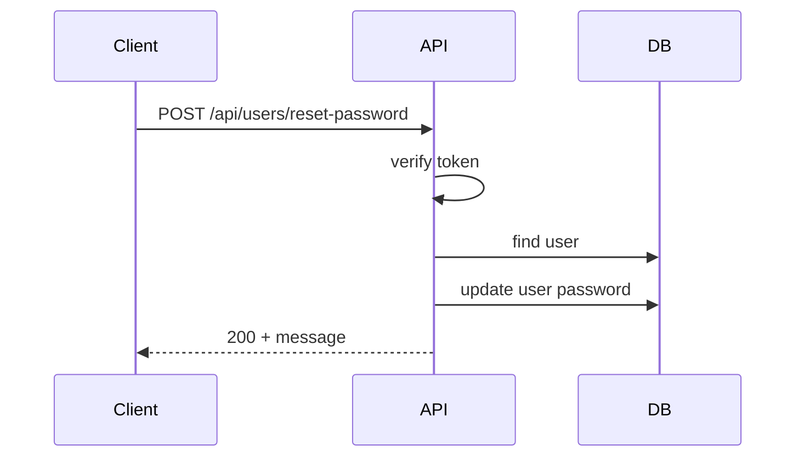

---

## 10. GET /oauth/google/url

- Method: `GET`
- Description: Tạo URL uỷ quyền Google OAuth.
- Authentication: Không yêu cầu.

### Query Parameters

- Không có.

### Success Response

- Status: `200 OK`
- Body:

```json
{
    "url": "string"
}
```

### Error Responses

- `500 Internal Server Error`: nếu biến môi trường Google thiếu hoặc lỗi xây dựng URL.

### Business Logic

- Xây dựng URL Google OAuth với:
    - `client_id`
    - `redirect_uri`
    - `response_type=code`
    - `scope=openid email profile`
    - `access_type=offline`
    - `prompt=consent`

### Sequence Diagram

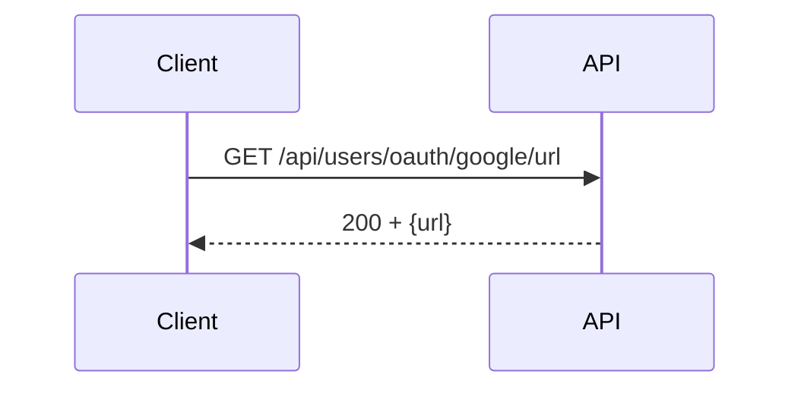

---

## 11. GET /oauth/google

- Method: `GET`
- Description: Xác thực Google OAuth và đăng nhập/đăng ký user.
- Authentication: Không yêu cầu.

### Query Parameters

- `code`: required, mã ủy quyền Google trả về.

### Success Response

- Redirects browser đến `CLIENT_REDIRECT_URI` với query params:
    - `access_token`
    - `refresh_token`
    - `new_user` = `1` hoặc `0`

### Error Responses

- `403 Forbidden`: email Google chưa verified.
- `500 Internal Server Error`: nếu gọi Google API lỗi.

### Business Logic

- Đổi `code` lấy Google access token và id token.
- Lấy thông tin user Google.
- Nếu email chưa verified: lỗi.
- Nếu user tồn tại trong DB theo email:
    - tạo token mới, lưu refresh token.
- Nếu user chưa tồn tại:
    - tạo user mới với random password, verify = Verified.
    - tạo access token và refresh token.
- Redirect về `CLIENT_REDIRECT_URI` kèm token.

### Sequence Diagram

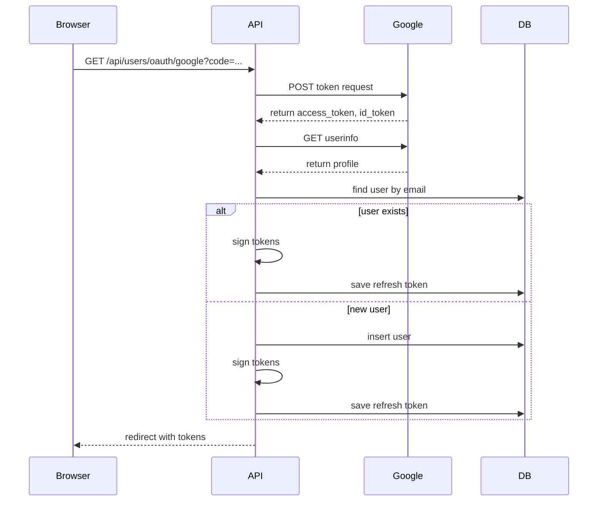
