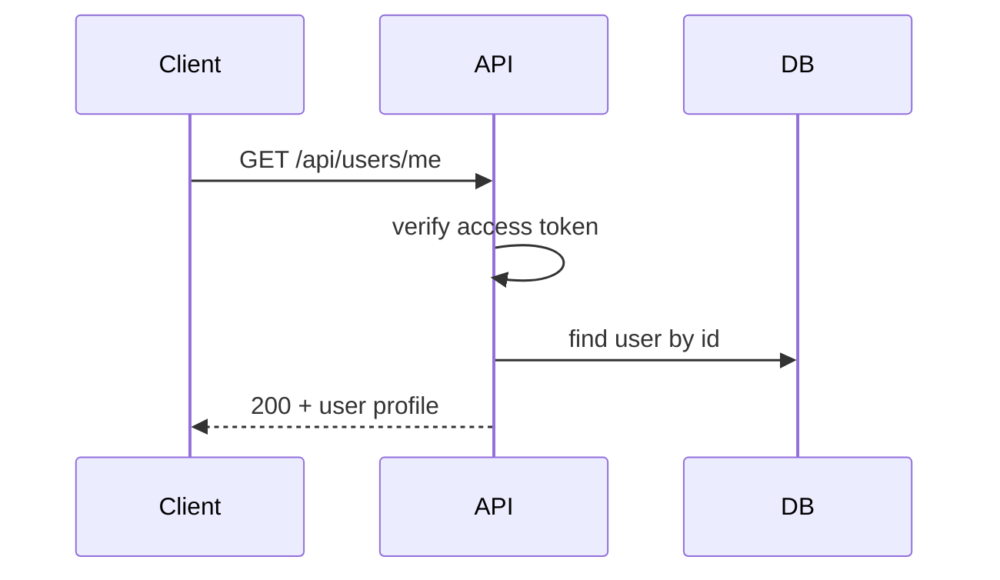
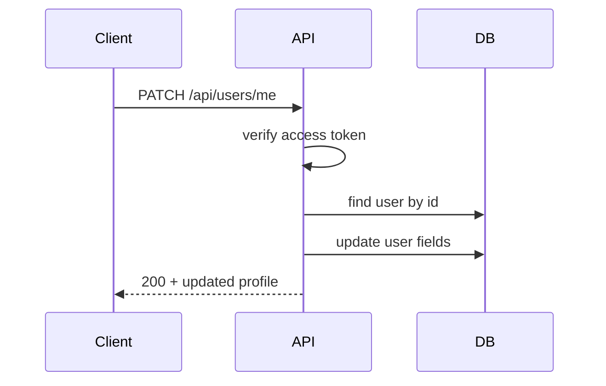
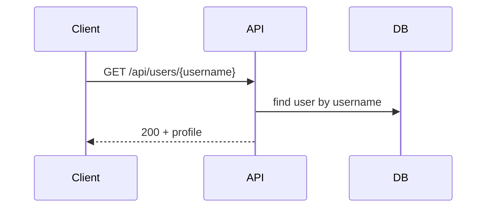
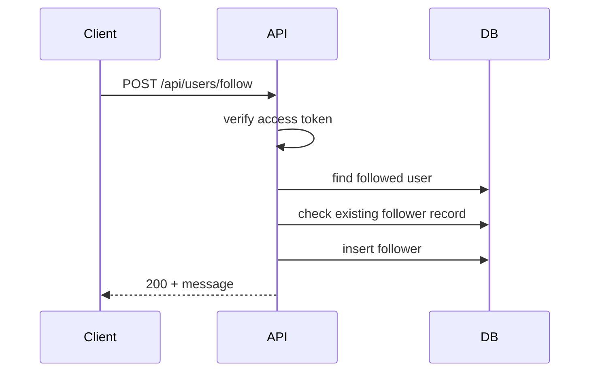
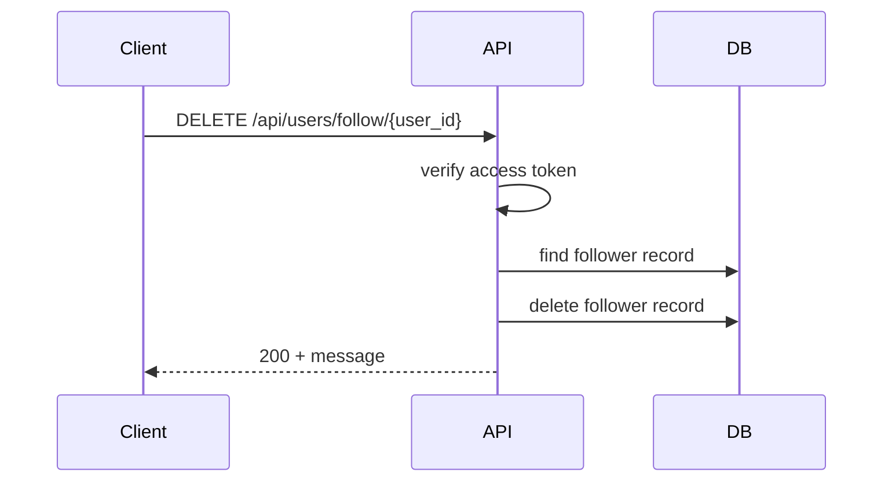
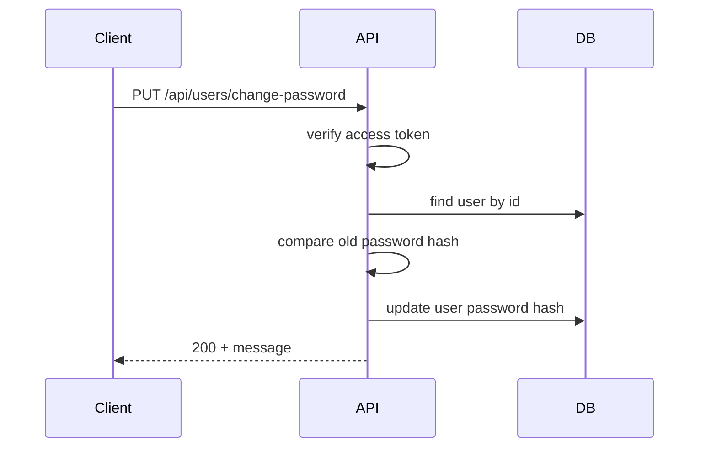

# Users APIs

Tất cả endpoint trong tài liệu này bắt đầu với base path:

`/api/users`

---

## 1. GET /me

- Method: `GET`
- Description: Lấy thông tin profile của người dùng đang đăng nhập.
- Authentication: Yêu cầu Bearer access token.

### Headers

- `Authorization: Bearer <access_token>`

### Validation Rules

- `Authorization` required, phải là JWT access token hợp lệ.
- User phải tồn tại.
- User phải được xác thực (`verify = Verified`).

### Success Response

- Status: `200 OK`
- Body:

```json
{
    "message": "Lấy thông tin người dùng thành công",
    "result": {
        "_id": "string",
        "name": "string",
        "email": "string",
        "date_of_birth": "string",
        "bio": "string",
        "avatar": "string",
        "verify": 0,
        "created_at": "string",
        "updated_at": "string"
    }
}
```

### Error Responses

- `401 Unauthorized`: access token không hợp lệ.
- `403 Forbidden`: user chưa xác thực.
- `404 Not Found`: user không tồn tại.

### Business Logic

- Verify access token.
- Kiểm tra user tồn tại và đã verify.
- Trả về thông tin user, loại trừ mật khẩu và các token ẩn.

### Sequence Diagram



---

## 2. PATCH /me

- Method: `PATCH`
- Description: Cập nhật profile người dùng hiện tại.
- Authentication: Yêu cầu Bearer access token.

### Headers

- `Authorization: Bearer <access_token>`

### Request Body

```json
{
    "name": "string",
    "date_of_birth": "YYYY-MM-DD",
    "bio": "string",
    "location": "string",
    "website": "string",
    "username": "string",
    "avatar": "string",
    "cover_photo": "string"
}
```

### Validation Rules

- `Authorization` required, access token hợp lệ.
- User tồn tại và verified.
- `name`: optional, string, 1-100 ký tự.
- `date_of_birth`: optional, ISO 8601 date.
- `bio`: optional, string, 1-200 ký tự.
- `username`: optional, string, phù hợp regex username.
    - regex tương ứng: 4-15 ký tự, chữ cái/số/dấu gạch dưới, không chỉ toàn số.
    - không trùng username đã tồn tại.
- `avatar`: optional, valid URL.

### Success Response

- Status: `200 OK`
- Body:

```json
{
    "message": "Cập nhật thông tin thành công",
    "result": {
        "_id": "string",
        "name": "string",
        "email": "string",
        "date_of_birth": "string",
        "bio": "string",
        "avatar": "string",
        "created_at": "string",
        "updated_at": "string"
    }
}
```

### Error Responses

- `401 Unauthorized`: access token không hợp lệ.
- `403 Forbidden`: user chưa xác thực.
- `404 Not Found`: user không tồn tại.
- `409 Conflict`: username đã tồn tại.
- `422 Unprocessable Entity`: dữ liệu không hợp lệ.

### Business Logic

- Filter các trường body chỉ cho phép cập nhật các key: `name`, `date_of_birth`, `bio`, `location`, `website`, `username`, `avatar`, `cover_photo`.
- Chuyển `date_of_birth` về `Date` khi cần.
- Cập nhật user và trả về document sau khi update.

### Sequence Diagram



---

## 3. GET /:username

- Method: `GET`
- Description: Lấy profile user theo username công khai.
- Authentication: Không yêu cầu.

### URL Params

- `username`: required, username của người dùng.

### Validation Rules

- `username`: required, string, user phải tồn tại.

### Success Response

- Status: `200 OK`
- Body:

```json
{
    "message": "Lấy thông tin người dùng thành công",
    "result": {
        "_id": "string",
        "name": "string",
        "email": "string",
        "date_of_birth": "string",
        "created_at": "string",
        "updated_at": "string",
        "bio": "string",
        "location": "string",
        "website": "string",
        "username": "string",
        "avatar": "string",
        "cover_photo": "string"
    }
}
```

### Error Responses

- `404 Not Found`: user không tồn tại.
- `422 Unprocessable Entity`: username không hợp lệ.

### Business Logic

- Tìm user theo trường `username`.
- Trả về profile và loại trừ các trường nhạy cảm như password, token verify.

### Sequence Diagram



---

## 4. POST /follow

- Method: `POST`
- Description: Follow người dùng khác.
- Authentication: Yêu cầu Bearer access token.

### Headers

- `Authorization: Bearer <access_token>`

### Request Body

```json
{
    "followed_user_id": "string"
}
```

### Validation Rules

- `Authorization`: required, access token hợp lệ.
- `followed_user_id`: required, valid ObjectId.
- Không được follow chính mình.
- User đích phải tồn tại.
- User đích phải đã verify.

### Success Response

- Status: `200 OK`
- Body:

```json
{
    "message": "Follow thành công"
}
```

### Error Responses

- `401 Unauthorized`: access token không hợp lệ.
- `403 Forbidden`: follow user chưa verify.
- `404 Not Found`: user đích không tồn tại.
- `409 Conflict`: đã follow trước đó.
- `422 Unprocessable Entity`: dữ liệu không hợp lệ.

### Business Logic

- Xác thực access token.
- Kiểm tra user đích tồn tại và verified.
- Kiểm tra không follow chính mình.
- Nếu chưa follow, tạo document mới trong collection `followers`.

### Sequence Diagram



---

## 5. DELETE /follow/:user_id

- Method: `DELETE`
- Description: Unfollow người dùng đã follow.
- Authentication: Yêu cầu Bearer access token.

### Headers

- `Authorization: Bearer <access_token>`

### URL Params

- `user_id`: required, ID người dùng muốn unfollow.

### Validation Rules

- `user_id`: required, valid ObjectId, user tồn tại.

### Success Response

- Status: `200 OK`
- Body:

```json
{
    "message": "Unfollow thành công"
}
```

### Error Responses

- `401 Unauthorized`: access token không hợp lệ.
- `404 Not Found`: user đích không tồn tại.
- `409 Conflict`: bạn chưa follow người dùng này.
- `422 Unprocessable Entity`: params không hợp lệ.

### Business Logic

- Xác thực access token.
- Kiểm tra record follow tồn tại.
- Xóa document follow nếu đã follow.

### Sequence Diagram



---

## 6. PUT /change-password

- Method: `PUT`
- Description: Đổi mật khẩu của người dùng đang đăng nhập.
- Authentication: Yêu cầu Bearer access token.

### Headers

- `Authorization: Bearer <access_token>`

### Request Body

```json
{
    "old_password": "string",
    "new_password": "string",
    "confirm_new_password": "string"
}
```

### Validation Rules

- `old_password`: required, string, 6-50 ký tự.
- `new_password`: required, 6-50 ký tự, mạnh, khác `old_password`.
- `confirm_new_password`: required, phải khớp `new_password`.
- `old_password` phải đúng mật khẩu hiện tại của user.

### Success Response

- Status: `200 OK`
- Body:

```json
{
    "message": "Đổi mật khẩu thành công"
}
```

### Error Responses

- `401 Unauthorized`: access token không hợp lệ hoặc mật khẩu cũ không đúng.
- `404 Not Found`: user không tồn tại.
- `422 Unprocessable Entity`: dữ liệu không hợp lệ.

### Business Logic

- Verify access token.
- Kiểm tra mật khẩu cũ khớp với hash password lưu trong DB.
- Hash mật khẩu mới và cập nhật user.

### Sequence Diagram


